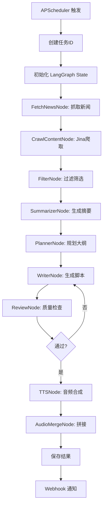

# 新闻播客自动生成工具 - 技术设计文档

> 版本: v1.0
> 更新日期: 2025-02-05
> 项目名称: Podcast Factory MVP

## 一、项目概述

### 1.1 产品定位

本项目旨在构建一个自动化新闻播客生成系统，通过 AI 技术从新闻源抓取内容，生成由"老罗"与"自如"两位虚拟主播主持的对话式播客节目。

**核心功能：**
- 定时自动从华尔街见闻抓取新闻
- 使用 Jina Reader 提取新闻正文
- Gemini Pro 生成深度摘要和播客脚本
- MiniMax TTS 合成双音色音频
- 输出逐字稿（供人工校对）和最终播客音频

### 1.2 技术栈

| 层级 | 技术选型 | 用途 |
|------|----------|------|
| API 框架 | FastAPI | Web 服务入口 |
| 编排引擎 | LangGraph | 工作流状态机 |
| LLM | Gemini Pro | 内容生成 |
| 爬虫 | Jina Reader API | 正文提取 |
| TTS | MiniMax API | 语音合成 |
| 音频处理 | FFmpeg/pydub | 音频拼接 |
| 定时任务 | APScheduler | 定时调度 |
| 部署 | Docker | 容器化 |

### 1.3 运行环境要求

- Python 3.11+
- Docker & Docker Compose
- FFmpeg (音频处理)
- API Keys:
  - Gemini Pro API Key
  - MiniMax API Key

---

## 二、整体架构设计

### 2.1 架构图

```
┌─────────────────────────────────────────────────────────────┐
│                      定时调度层                              │
│                   (APScheduler)                              │
│         每天固定时间触发: /api/generate                      │
└─────────────────────────────────────────────────────────────┘
                            ↓
┌─────────────────────────────────────────────────────────────┐
│                     API 层 (FastAPI)                         │
│  POST /generate      触发生成播客                            │
│  GET /status/{id}   查询任务状态                            │
│  GET /result/{id}   获取生成结果                            │
│  GET /health        健康检查                                │
└─────────────────────────────────────────────────────────────┘
                            ↓
┌─────────────────────────────────────────────────────────────┐
│                编排层 (LangGraph Workflow)                   │
│                                                            │
│   FetchNews → CrawlContent → Filter → Summarize →         │
│   Plan → Write → Review → TTS → MergeAudio → Complete      │
│                                                            │
└─────────────────────────────────────────────────────────────┘
                            ↓
┌─────────────────────────────────────────────────────────────┐
│                     服务层 (Services)                        │
│  ┌──────────┐ ┌──────────┐ ┌──────────┐ ┌──────────┐      │
│  │  News    │ │ Crawler  │ │   LLM    │ │   TTS    │      │
│  │ Service  │ │ Service  │ │ Service  │ │ Service  │      │
│  └──────────┘ └──────────┘ └──────────┘ └──────────┘      │
│  ┌──────────┐ ┌──────────┐                                 │
│  │  Audio   │ │Scheduler │                                 │
│  │ Service  │ │ Service  │                                 │
│  └──────────┘ └──────────┘                                 │
└─────────────────────────────────────────────────────────────┘
                            ↓
┌─────────────────────────────────────────────────────────────┐
│                     数据存储层                               │
│  data/                                                         │
│  ├── raw/           # 原始新闻数据 (JSON)                    │
│  ├── summaries/     # 新闻摘要 (JSON)                        │
│  ├── scripts/       # 播客逐字稿 (JSON/MD)                   │
│  ├── audio/                                           │
│  │   ├── segments/  # 音频片段 (MP3)                        │
│  │   └── final/     # 最终成品 (MP3)                        │
│  └── logs/          # 运行日志                              │
└─────────────────────────────────────────────────────────────┘
```

### 2.2 数据流

```
1. 定时触发 → 2. 抓取新闻 → 3. 爬取正文 → 4. 过滤筛选
                                                              ↓
6. TTS合成 ← 5. 脚本生成 ←                 ←  4. Top 10 新闻
                                                              ↓
8. 输出成品 ← 7. 音频拼接 ← 6. 音频片段列表
                                                              ↓
                    9. 存储: 逐字稿 + 音频
```

---

## 三、LangGraph 状态机设计

### 3.1 State 定义

```python
# app/graph/state.py

from typing import TypedDict, List, Dict, Optional
from datetime import datetime

class NewsItem(TypedDict):
    """单条新闻数据结构"""
    title: str                      # 新闻标题
    url: str                        # 新闻链接
    source: str                     # 新闻来源
    published_at: Optional[str]     # 发布时间
    full_content: Optional[str]     # Jina Reader 抓取的正文
    summary: Optional[str]         # LLM 生成的摘要

class DialogueSegment(TypedDict):
    """对话片段"""
    speaker: str                    # "Luo" | "Ziru"
    text: str                      # 对话文本
    audio_path: Optional[str]      # 对应音频路径

class PodcastState(TypedDict):
    """播客生成的全局状态"""
    # ===== 任务标识 =====
    task_id: str                   # 任务唯一ID
    news_source: str              # 新闻源 ID

    # ===== 第一阶段：数据摄取 =====
    raw_news_list: List[NewsItem] # 原始新闻列表

    # ===== 第二阶段：过滤和摘要 =====
    filtered_news: List[NewsItem]  # 过滤后的新闻
    top_news: List[NewsItem]       # 筛选出的 Top 10 深度摘要

    # ===== 第三阶段：规划和生成 =====
    podcast_outline: Dict          # 节目大纲
    script_segments: List[DialogueSegment]  # 对话分段
    full_script: str              # 完整逐字稿（供校对）

    # ===== 第四阶段：音频合成 =====
    audio_segments: List[str]      # 音频片段路径列表
    final_audio_path: Optional[str] # 最终音频路径

    # ===== 元数据 =====
    created_at: str                # 创建时间
    updated_at: str                # 更新时间
    status: str                   # running | pending_review | completed | failed
    error: Optional[str]           # 错误信息
    review_approved: bool         # 审核是否通过
```

### 3.2 Workflow 流程图

```
                              START
                                ↓
                    ┌───────────────────────┐
                    │   FetchNewsNode       │ 抓取新闻标题和URL
                    │   (从NewsNow API)     │
                    └───────────────────────┘
                                ↓
                    ┌───────────────────────┐
                    │   CrawlContentNode     │ Jina Reader 并发爬取正文
                    │   (r.jina.ai)          │
                    └───────────────────────┘
                                ↓
                    ┌───────────────────────┐
                    │     FilterNode         │ 过滤付费墙、无效内容
                    │   选 Top 10 新闻       │
                    └───────────────────────┘
                                ↓
                    ┌───────────────────────┐
                    │  SummarizerNode        │ 并发生成深度摘要
                    │   (Map 阶段)           │
                    └───────────────────────┘
                                ↓
                    ┌───────────────────────┐
                    │    PlannerNode        │ 规划播客大纲
                    │   (开场 + 3-4板块)    │
                    └───────────────────────┘
                                ↓
                    ┌───────────────────────┐
                    │    WriterNode          │ 循环生成对话脚本
                    │   (Reduce 阶段)        │ 保持人设一致性
                    └───────────────────────┘
                                ↓
                    ┌───────────────────────┐
                    │    ReviewNode          │ 质量检查
                    │   (长度/一致性/审核)   │
                    └───────────────────────┘
                                ↓
              ┌────────────────┼────────────────┐
              ↓ 不通过                              ↓ 通过
    ┌─────────────────┐                  ┌───────────────────────┐
    │ 返回 WriterNode │                  │      TTSNode          │
    │   重新生成       │                  │  MiniMax 并发合成     │
    └─────────────────┘                  └───────────────────────┘
                                                    ↓
                                    ┌───────────────────────┐
                                    │  AudioMergeNode       │
                                    │  FFmpeg 拼接音频       │
                                    └───────────────────────┘
                                                    ↓
                                          ┌─────────────────┐
                                          │      END        │
                                          │  输出: 逐字稿+音频 │
                                          └─────────────────┘
```

### 3.3 节点详解

| 节点 | 输入 | 处理逻辑 | 输出 |
|------|------|----------|------|
| FetchNewsNode | news_source | 调用 NewsNow API 获取新闻列表 | raw_news_list |
| CrawlContentNode | raw_news_list | Jina Reader 并发爬取正文 | raw_news_list (带 full_content) |
| FilterNode | raw_news_list | 过滤付费墙、短内容，选 Top 10 | filtered_news, top_news |
| SummarizerNode | top_news | 并发生成深度摘要 | top_news (带 summary) |
| PlannerNode | top_news | 规划节目大纲 | podcast_outline |
| WriterNode | podcast_outline | 分段生成对话，保持人设 | script_segments, full_script |
| ReviewNode | script_segments | 质量检查、人设一致性校验 | review_approved |
| TTSNode | script_segments | 并发调用 TTS 生成音频 | audio_segments |
| AudioMergeNode | audio_segments | FFmpeg 无缝拼接 | final_audio_path |

---

## 四、核心模块设计

### 4.1 NewsService - 新闻获取

```python
# app/services/news.py

import httpx
from typing import List, Dict
import logging

logger = logging.getLogger(__name__)

class NewsNowService:
    """NewsNow API 新闻获取服务"""

    BASE_URL = "https://newsnow.busiyi.world/api/s"

    def __init__(self, timeout: int = 10):
        self.timeout = timeout
        self.client = httpx.AsyncClient(timeout=timeout)

    async def fetch_news(
        self,
        source_id: str = "wallstreetcn-news",
        limit: int = 30
    ) -> List[Dict]:
        """
        从 NewsNow 获取新闻列表

        Args:
            source_id: 新闻源 ID (如 wallstreetcn-news)
            limit: 获取数量上限

        Returns:
            新闻列表 [{title, url, source, published_at}]
        """
        try:
            params = {"id": source_id}
            response = await self.client.get(self.BASE_URL, params=params)
            response.raise_for_status()

            data = response.json()

            # 解析 NewsNow API 返回格式
            news_list = []
            items = data.get("data", [])[:limit]

            for item in items:
                news_list.append({
                    "title": item.get("title", ""),
                    "url": item.get("url", ""),
                    "source": "wallstreetcn",
                    "published_at": item.get("published_at", "")
                })

            logger.info(f"Fetched {len(news_list)} news items from {source_id}")
            return news_list

        except Exception as e:
            logger.error(f"Error fetching news: {str(e)}")
            return []

    async def close(self):
        await self.client.aclose()
```

### 4.2 CrawlerService - Jina Reader 正文提取

```python
# app/services/crawler.py

import httpx
from typing import Optional, Dict
import logging
import asyncio

logger = logging.getLogger(__name__)

class JinaReaderService:
    """Jina Reader API 内容提取服务"""

    BASE_URL = "https://r.jina.ai/"

    def __init__(self, timeout: int = 30):
        self.timeout = timeout
        self.client = httpx.AsyncClient(timeout=timeout)

    async def fetch_content(self, url: str) -> Optional[str]:
        """
        抓取 URL 内容，返回 LLM 友好的 Markdown 格式

        Args:
            url: 目标网页 URL

        Returns:
            Markdown 格式内容，失败返回 None
        """
        try:
            jina_url = f"{self.BASE_URL}{url}"
            logger.info(f"Fetching content from: {url}")

            response = await self.client.get(jina_url)
            response.raise_for_status()

            content = response.text.strip()

            # 验证内容有效性
            if len(content) < 100:
                logger.warning(f"Content too short for {url}")
                return None

            # 检查是否触发反爬 (Jina 返回错误信息)
            if "jina.ai Reader" not in content and len(content) < 200:
                logger.warning(f"Potential blocking for {url}")
                return None

            logger.info(f"Successfully fetched {len(content)} chars from {url}")
            return content

        except httpx.HTTPStatusError as e:
            logger.error(f"HTTP error {e.response.status_code} for {url}")
            return None
        except httpx.TimeoutException:
            logger.error(f"Timeout fetching {url}")
            return None
        except Exception as e:
            logger.error(f"Error fetching {url}: {str(e)}")
            return None

    async def batch_fetch(
        self,
        urls: List[str],
        max_concurrent: int = 5
    ) -> Dict[str, Optional[str]]:
        """
        并发抓取多个 URL

        Args:
            urls: URL 列表
            max_concurrent: 最大并发数

        Returns:
            {url: content} 字典
        """
        semaphore = asyncio.Semaphore(max_concurrent)

        async def fetch_with_semaphore(url: str):
            async with semaphore:
                return url, await self.fetch_content(url)

        tasks = [fetch_with_semaphore(url) for url in urls]
        results = await asyncio.gather(*tasks, return_exceptions=True)

        output = {}
        for result in results:
            if isinstance(result, Exception):
                continue
            url, content = result
            output[url] = content

        return output

    async def close(self):
        await self.client.aclose()
```

### 4.3 LangGraph Nodes

```python
# app/graph/nodes.py

import asyncio
import logging
from typing import Dict, List
from app.services.news import NewsNowService
from app.services.crawler import JinaReaderService
from app.services.llm import GeminiService
from app.graph.state import PodcastState, NewsItem

logger = logging.getLogger(__name__)

# ==================== 节点 1: 抓取新闻 ====================

async def fetch_news_node(state: PodcastState) -> Dict:
    """从 NewsNow 抓取新闻标题和 URL"""
    logger.info("=== FetchNewsNode: Starting ===")

    news_service = NewsNowService()
    try:
        news_list = await news_service.fetch_news(
            source_id=state["news_source"],
            limit=30
        )

        raw_news = [
            NewsItem(
                title=item["title"],
                url=item["url"],
                source=item["source"],
                published_at=item.get("published_at"),
                full_content=None,
                summary=None
            )
            for item in news_list
        ]

        logger.info(f"Fetched {len(raw_news)} news items")
        return {"raw_news_list": raw_news}
    finally:
        await news_service.close()


# ==================== 节点 2: 爬取正文 ====================

async def crawl_content_node(state: PodcastState) -> Dict:
    """使用 Jina Reader 并发爬取新闻正文"""
    logger.info("=== CrawlContentNode: Starting ===")

    raw_news = state["raw_news_list"]
    urls = [news["url"] for news in raw_news]

    crawler = JinaReaderService(timeout=30)
    try:
        url_to_content = await crawler.batch_fetch(urls, max_concurrent=5)

        for news in raw_news:
            news["full_content"] = url_to_content.get(news["url"])

        success_count = sum(1 for n in raw_news if n["full_content"])
        logger.info(f"Successfully crawled {success_count}/{len(raw_news)} articles")
        return {"raw_news_list": raw_news}
    finally:
        await crawler.close()


# ==================== 节点 3: 过滤新闻 ====================

async def filter_node(state: PodcastState) -> Dict:
    """过滤无效新闻，选出 Top 10"""
    logger.info("=== FilterNode: Starting ===")

    raw_news = state["raw_news_list"]

    filtered = []
    for news in raw_news:
        content = news.get("full_content", "")

        # 过滤规则
        if not content:
            continue
        if len(content) < 200:
            continue
        if "付费" in content[:100] or "会员专享" in content[:100]:
            continue
        # 排除广告、软文等
        if "广告" in content[:50].lower():
            continue

        filtered.append(news)

    # 按内容质量排序
    filtered.sort(key=lambda x: len(x.get("full_content", "")), reverse=True)
    top_news = filtered[:10]

    logger.info(f"Filtered to {len(top_news)} high-quality news items")
    return {"filtered_news": filtered, "top_news": top_news}


# ==================== 节点 4: 生成摘要 ====================

async def summarizer_node(state: PodcastState) -> Dict:
    """并发生成每条新闻的深度摘要"""
    logger.info("=== SummarizerNode: Starting ===")

    top_news = state["top_news"]
    llm = GeminiService()

    async def summarize_one(news: NewsItem) -> NewsItem:
        prompt = f"""
请为以下新闻生成一个150-200字的深度摘要，要求：
1. 提炼核心信息和关键数据
2. 分析背后的原因和影响
3. 适合在播客中讨论

新闻标题：{news['title']}

新闻正文：
{news['full_content'][:2000]}

请直接输出摘要，不要有其他内容。
"""
        news["summary"] = await llm.generate(prompt)
        return news

    tasks = [summarize_one(news) for news in top_news]
    summarized_news = await asyncio.gather(*tasks)

    logger.info(f"Generated summaries for {len(summarized_news)} items")
    return {"top_news": list(summarized_news)}


# ==================== 节点 5: 规划大纲 ====================

async def planner_node(state: PodcastState) -> Dict:
    """规划播客大纲"""
    logger.info("=== PlannerNode: Starting ===")

    llm = GeminiService()

    summaries_text = "\n\n".join([
        f"新闻{i+1}: {news['title']}\n摘要: {news['summary']}"
        for i, news in enumerate(state["top_news"])
    ])

    prompt = f"""
作为一位资深播客策划，请为以下10条新闻设计一档20分钟播客的节目大纲。

要求：
1. 设计开场白（2分钟）：引入今日话题
2. 3-4个板块：每板块围绕2-3条相关新闻展开讨论
3. 设计板块过渡语
4. 最后有结束语

新闻摘要：
{summaries_text}

请以JSON格式输出，格式如下：
{{
    "opening": "开场白全文",
    "segments": [
        {{
            "title": "板块1标题",
            "news_indices": [0, 1, 2],
            "description": "板块内容概述"
        }}
    ],
    "closing": "结束语全文"
}}
"""

    outline = await llm.generate_json(prompt)
    logger.info("Generated podcast outline")
    return {"podcast_outline": outline}


# ==================== 节点 6: 生成脚本 ====================

async def writer_node(state: PodcastState) -> Dict:
    """生成对话脚本"""
    logger.info("=== WriterNode: Starting ===")

    from app.agents.personas import LUO_YONGHAO_PERSONA, WANG_ZIRU_PERSONA

    outline = state["podcast_outline"]
    top_news = state["top_news"]
    llm = GeminiService()

    segments = []

    # 生成开场
    opening_prompt = f"""
{LUO_YONGHAO_PERSONA}

{WANG_ZIRU_PERSONA}

请为以下播客节目写一段2分钟的开场对话。

节目大纲开场白：
{outline['opening']}

要求：
1. 使用老罗和自如的对话形式
2. 老罗先开口，语气幽默犀利
3. 自然引入今天的话题
4. 控制在400-500字左右

请以JSON格式输出：
{{
    "segments": [
        {{"speaker": "Luo", "text": "老罗的台词"}},
        {{"speaker": "Ziru", "text": "自如的台词"}}
    ]
}}
"""

    opening = await llm.generate_json(opening_prompt)
    segments.extend(opening["segments"])

    # 生成各板块
    for i, seg in enumerate(outline["segments"]):
        news_items = [top_news[idx] for idx in seg["news_indices"]]
        news_context = "\n\n".join([
            f"新闻{idx+1}：{n['title']}\n{n['summary']}"
            for idx, n in enumerate(news_items)
        ])

        segment_prompt = f"""
{LUO_YONGHAO_PERSONA}

{WANG_ZIRU_PERSONA}

请为以下播客板块写一段对话，时长约4-5分钟。

板块{i+1}：{seg['title']}
板块概述：{seg['description']}

相关新闻：
{news_context}

要求：
1. 老罗和自如交替发言
2. 老罗负责犀利点评和批评
3. 自如负责专业分析和技术解读
4. 包含具体新闻内容引用
5. 控制在800-1000字左右

请以JSON格式输出：
{{
    "segments": [
        {{"speaker": "Luo", "text": "..."}},
        {{"speaker": "Ziru", "text": "..."}}
    ]
}}
"""

        segment = await llm.generate_json(segment_prompt)
        segments.extend(segment["segments"])

    # 生成结束语
    closing_prompt = f"""
{LUO_YONGHAO_PERSONA}

{WANG_ZIRU_PERSONA}

请为以下播客写一段1分钟的结束对话。

节目大纲结束语：
{outline['closing']}

要求：
1. 老罗先开口，做简单总结
2. 自如补充并说再见
3. 语气自然，不要太煽情
4. 控制在200-300字左右

请以JSON格式输出：
{{
    "segments": [
        {{"speaker": "Luo", "text": "..."}},
        {{"speaker": "Ziru", "text": "..."}}
    ]
}}
"""

    closing = await llm.generate_json(closing_prompt)
    segments.extend(closing["segments"])

    # 合并为完整逐字稿
    full_script = "\n\n".join([
        f"【{s['speaker']}】{s['text']}"
        for s in segments
    ])

    logger.info(f"Generated script with {len(segments)} segments")
    return {
        "script_segments": segments,
        "full_script": full_script
    }
```

---

## 五、人设 Prompt 设计

### 5.1 罗永浩人设

```python
# app/agents/personas.py

LUO_YONGHAO_PERSONA = """
你是罗永浩，中国知名的科技评论人和企业家，以犀利、直接、幽默的说话风格著称。

## 语言风格特征

1. **犀利直接**
   - 敢于表达不同观点，不怕得罪人
   - 对不合理的产品设计直接批评
   - 常用"说实话"、"我觉得这就是扯淡"

2. **幽默诙谐**
   - 善用自嘲和讽刺
   - 说话像脱口秀，有节奏感
   - 经常用生动的比喻

3. **批判精神**
   - 对行业乱象深恶痛绝
   - 敢于揭露虚假宣传
   - 批判但有建设性

4. **专业素养**
   - 对产品有极高审美标准
   - 关注用户体验细节
   - 懂技术但不说行话

## 常用表达

- "这个事儿吧..."
- "说实话..."
- "我跟你讲..."
- "这就是典型的..."
- "你想想看..."
- "太扯了"
- "我当时就震惊了"
- "这个设计的人是不是脑子进水了"

## 角色定位

- 对话题进行犀利点评
- 提出尖锐问题
- 表达强烈观点
- 调节气氛，制造笑点

## 禁忌

- 不要过度煽情
 - 不要说空话套话
- 不要违背事实夸大
- 不要人身攻击
"""

WANG_ZIRU_PERSONA = """
你是王自如，年轻的科技产品经理和评测人，以专业、客观、理性的分析风格著称。

## 语言风格特征

1. **专业客观**
   - 注重数据和事实
   - 分析有逻辑性
   - 不偏激，不情绪化

2. **表达清晰**
   - 语言简洁明了
   - 善于结构化表达
   - 技术概念解释得通俗易懂

3. **温和理性**
   - 情绪稳定，不急躁
   - 愿意倾听不同观点
   - 适时提出不同视角

4. **产品思维**
   - 关注用户需求
   - 理解商业逻辑
   - 平衡多方因素

## 常用表达

- "从产品角度来看..."
- "技术上来说..."
- "这个设计的逻辑是..."
- "我觉得..."
- "确实..."
- "但是我们也要看到..."
- "从数据来看..."
- "这个要分两面来看"

## 角色定位

- 提供专业视角
- 补充技术细节
- 平衡老罗的犀利
- 引导话题深入

## 禁忌

- 不要人云亦云
- 不要没有立场
- 不要过度technical
- 不要打断老罗的节奏
"""

# ==================== 对话规则 ====================

DIALOGUE_RULES = """
## 对话规则

1. **交替发言**
   - 老罗和自如交替说话
   - 每人单次发言 2-5 句话
   - 不要一人连续说超过 3 轮

2. **内容平衡**
   - 老罗以观点、评价为主
   - 自如以分析、补充为主
   - 每条新闻至少被两人讨论

3. **过渡自然**
   - 使用"说到这个..."、"那我们来看..."等过渡语
   - 不要生硬跳转话题

4. **引用新闻**
   - 适当引用具体新闻内容
   - 可以质疑新闻观点
   - 不要照搬新闻原文

5. **长度控制**
   - 开头：400-500 字（2分钟）
   - 每个板块：800-1000 字（4-5分钟）
   - 结尾：200-300 字（1分钟）
   - 总时长：约 20 分钟
"""
```

---

## 六、TTS 音频合成

### 6.1 MiniMax TTS 服务

```python
# app/services/tts.py

import httpx
import os
from typing import Optional, List
import logging

logger = logging.getLogger(__name__)

class MiniMaxTTSService:
    """MiniMax 语音合成服务"""

    BASE_URL = "https://api.minimax.chat/v1"

    # 音色配置
    VOICES = {
        "Luo": {
            "voice_id": os.getenv("MINIMAX_VOICE_LUO", "male-shaonian"),
            "speed": 1.0,
            "volume": 1.0
        },
        "Ziru": {
            "voice_id": os.getenv("MINIMAX_VOICE_ZIRU", "female-yujie"),
            "speed": 1.0,
            "volume": 1.0
        }
    }

    def __init__(self):
        self.api_key = os.getenv("MINIMAX_API_KEY")
        self.client = httpx.AsyncClient(timeout=60)

    async def synthesize(
        self,
        text: str,
        speaker: str,
        output_path: str
    ) -> bool:
        """
        合成单条语音

        Args:
            text: 要合成的文本
            speaker: 说话人 (Luo | Ziru)
            output_path: 输出文件路径

        Returns:
            是否成功
        """
        voice_config = self.VOICES.get(speaker, self.VOICES["Ziru"])

        try:
            payload = {
                "model": "tts",
                "input": {"text": text},
                "voice": voice_config["voice_id"],
                "voice_setting": {
                    "speed": voice_config["speed"],
                    "volume": voice_config["volume"]
                }
            }

            headers = {
                "Authorization": f"Bearer {self.api_key}",
                "Content-Type": "application/json"
            }

            response = await self.client.post(
                f"{self.BASE_URL}/audio",
                json=payload,
                headers=headers
            )
            response.raise_for_status()

            # 保存音频文件
            with open(output_path, "wb") as f:
                f.write(response.content)

            logger.info(f"Synthesized audio for {speaker}: {output_path}")
            return True

        except Exception as e:
            logger.error(f"TTS error for {speaker}: {str(e)}")
            return False

    async def batch_synthesize(
        self,
        segments: List[dict],
        output_dir: str,
        task_id: str
    ) -> List[str]:
        """
        并发合成多个音频片段

        Returns:
            音频文件路径列表
        """
        import asyncio

        async def synthesize_one(
            segment: dict,
            index: int
        ) -> str:
            speaker = segment["speaker"]
            text = segment["text"]

            filename = f"{task_id}_{speaker}_{index:04d}.mp3"
            output_path = os.path.join(output_dir, filename)

            success = await self.synthesize(text, speaker, output_path)

            if success:
                return output_path
            else:
                raise Exception(f"Failed to synthesize segment {index}")

        tasks = [
            synthesize_one(seg, i)
            for i, seg in enumerate(segments)
        ]

        results = await asyncio.gather(*tasks, return_exceptions=True)

        audio_paths = []
        for r in results:
            if isinstance(r, Exception):
                logger.error(f"Segment synthesis failed: {r}")
            else:
                audio_paths.append(r)

        logger.info(f"Synthesized {len(audio_paths)}/{len(segments)} segments")
        return audio_paths

    async def close(self):
        await self.client.aclose()
```

### 6.2 音频拼接节点

```python
# app/services/audio.py

import os
import subprocess
import logging
from typing import List

logger = logging.getLogger(__name__)

class AudioMergeService:
    """音频拼接服务"""

    def merge_segments(
        self,
        audio_paths: List[str],
        output_path: str,
        fade_duration: float = 0.5
    ) -> bool:
        """
        使用 FFmpeg 拼接多个音频片段

        Args:
            audio_paths: 音频片段路径列表
            output_path: 输出文件路径
            fade_duration: 片段间交叉淡入淡出时长

        Returns:
            是否成功
        """
        if not audio_paths:
            logger.error("No audio segments to merge")
            return False

        try:
            # 创建文件列表
            list_file = output_path.replace(".mp3", "_list.txt")
            with open(list_file, "w") as f:
                for path in audio_paths:
                    f.write(f"file '{path}'\n")

            # FFmpeg 命令
            cmd = [
                "ffmpeg", "-y",
                "-f", "concat",
                "-safe", "0",
                "-i", list_file,
                "-af", f"afade=t=out:st=2:d={fade_duration},afade=t=in:st=0:d={fade_duration}",
                "-c:a", "libmp3lame",
                "-q:a", "2",
                output_path
            ]

            result = subprocess.run(cmd, capture_output=True, text=True)

            if result.returncode != 0:
                logger.error(f"FFmpeg error: {result.stderr}")
                return False

            # 清理临时文件
            os.remove(list_file)

            logger.info(f"Merged {len(audio_paths)} segments to {output_path}")
            return True

        except Exception as e:
            logger.error(f"Audio merge error: {str(e)}")
            return False

    def get_audio_duration(self, audio_path: str) -> float:
        """获取音频时长（秒）"""
        try:
            cmd = [
                "ffprobe", "-v", "error",
                "-show_entries", "format=duration",
                "-of", "default=noprint_wrappers=1:nokey=1",
                audio_path
            ]
            result = subprocess.run(cmd, capture_output=True, text=True)
            return float(result.stdout.strip())
        except Exception:
            return 0.0
```

---

## 七、项目结构

```
podcast-factory/
├── doc/                          # 文档目录
│   └── DESIGN.md                 # 本设计文档
│
├── app/                          # 应用主目录
│   ├── __init__.py
│   ├── main.py                  # FastAPI 入口
│   ├── config.py                # 配置管理
│   │
│   ├── graph/                   # LangGraph 核心
│   │   ├── __init__.py
│   │   ├── state.py            # 状态定义
│   │   ├── nodes.py            # 节点实现
│   │   └── workflow.py          # 工作流编排
│   │
│   ├── agents/                   # 人设 Prompt
│   │   ├── __init__.py
│   │   └── personas.py          # 人设定义
│   │
│   ├── services/                # 外部服务
│   │   ├── __init__.py
│   │   ├── news.py             # NewsNow API
│   │   ├── crawler.py          # Jina Reader
│   │   ├── llm.py              # Gemini Pro
│   │   ├── tts.py              # MiniMax TTS
│   │   ├── audio.py            # 音频处理
│   │   └── scheduler.py         # 定时任务
│   │
│   └── utils/                   # 工具函数
│       ├── __init__.py
│       ├── logger.py           # 日志配置
│       └── file_manager.py     # 文件管理
│
├── data/                        # 数据存储
│   ├── raw/                    # 原始新闻 (JSON)
│   ├── summaries/               # 新闻摘要 (JSON)
│   ├── scripts/                 # 播客逐字稿 (JSON)
│   ├── audio/
│   │   ├── segments/           # 音频片段
│   │   └── final/              # 最终成品
│   └── logs/                   # 运行日志
│
├── tests/                       # 测试
│   ├── test_crawler.py
│   ├── test_news.py
│   ├── test_workflow.py
│   └── conftest.py
│
├── .env.example                 # 环境变量模板
├── requirements.txt             # Python 依赖
├── Dockerfile                   # Docker 构建
├── docker-compose.yml           # Docker Compose
└── README.md                    # 项目说明
```

---

## 八、环境配置

### 8.1 .env.example

```bash
# API Keys
GEMINI_API_KEY=your_gemini_api_key
MINIMAX_API_KEY=your_minimax_api_key

# MiniMax Voice IDs
MINIMAX_VOICE_LUO=male-shaonian
MINIMAX_VOICE_ZIRU=female-yujie

# News Source
NEWS_SOURCE=wallstreetcn-news

# Scheduler
SCHEDULE_TIME=08:00

# Paths
DATA_DIR=./data
AUDIO_SEGMENTS_DIR=data/audio/segments
AUDIO_FINAL_DIR=data/audio/final
```

### 8.2 requirements.txt

```txt
fastapi==0.109.0
uvicorn[standard]==0.27.0
langgraph==0.1.0
langchain-core==0.2.0
langchain-google-genai==0.1.0

httpx==0.26.0
pydantic==2.5.3

apscheduler==3.10.4

python-dotenv==1.0.0

pydub==0.25.1
```

---

## 九、部署配置

### 9.1 Dockerfile

```dockerfile
FROM python:3.11-slim

WORKDIR /app

# 安装系统依赖（FFmpeg）
RUN apt-get update && apt-get install -y \
    ffmpeg \
    && rm -rf /var/lib/apt/lists/*

# 复制依赖文件
COPY requirements.txt .

# 安装 Python 依赖
RUN pip install --no-cache-dir -r requirements.txt

# 复制应用代码
COPY . .

# 创建数据目录
RUN mkdir -p data/audio/segments data/audio/final data/raw data/summaries data/scripts data/logs

# 暴露端口
EXPOSE 8000

# 启动命令
CMD ["uvicorn", "app.main:app", "--host", "0.0.0.0", "--port", "8000"]
```

### 9.2 docker-compose.yml

```yaml
version: '3.8'

services:
  podcast-factory:
    build: .
    container_name: podcast-factory
    ports:
      - "8000:8000"
    volumes:
      - ./data:/app/data
      - ./logs:/app/logs
    environment:
      - GEMINI_API_KEY=${GEMINI_API_KEY}
      - MINIMAX_API_KEY=${MINIMAX_API_KEY}
      - NEWS_SOURCE=wallstreetcn-news
      - SCHEDULE_TIME=08:00
    restart: unless-stopped
    healthcheck:
      test: ["CMD", "curl", "-f", "http://localhost:8000/health"]
      interval: 30s
      timeout: 10s
      retries: 3
```

---

## 十、API 接口设计

### 10.1 接口列表

| 方法 | 路径 | 描述 |
|------|------|------|
| POST | `/api/generate` | 触发播客生成 |
| GET | `/api/status/{task_id}` | 查询任务状态 |
| GET | `/api/result/{task_id}` | 获取生成结果 |
| GET | `/api/tasks` | 获取所有任务 |
| DELETE | `/api/task/{task_id}` | 删除任务 |
| GET | `/health` | 健康检查 |

### 10.2 请求/响应示例

**POST /api/generate**

```json
{
  "source": "wallstreetcn-news"
}
```

**GET /api/status/{task_id}**

```json
{
  "task_id": "20250205_080000",
  "status": "running",
  "progress": {
    "current_step": "Generating script",
    "percent": 65
  },
  "created_at": "2025-02-05T08:00:00",
  "updated_at": "2025-02-05T08:15:00"
}
```

**GET /api/result/{task_id}**

```json
{
  "task_id": "20250205_080000",
  "status": "completed",
  "result": {
    "script_path": "data/scripts/20250205_080000.json",
    "audio_path": "data/audio/final/20250205_080000.mp3",
    "duration_minutes": 20
  }
}
```

---

## 十一、运行流程

### 11.1 定时任务流程



### 11.2 手动触发流程

```
curl -X POST http://localhost:8000/api/generate \
  -H "Content-Type: application/json" \
  -d '{"source": "wallstreetcn-news"}'
```

---

## 十二、后续优化方向

### Phase 2 (后续迭代)

1. **多新闻源支持**
   - 添加更多 NewsNow 频道
   - 支持自定义 RSS 源

2. **人设记忆增强**
   - 使用 LangGraph Checkpointer
   - 记录跨话题的背景信息

3. **内容质量优化**
   - 引入 RAG 技术检索相关背景知识
   - 添加事实核查节点

4. **音频质量优化**
   - 添加背景音乐
   - 音效和转场处理
   - 音量标准化

### Phase 3 (高级功能)

1. **多模板支持**
   - 不同的节目风格
   - 不同的主播组合

2. **交互式生成**
   - 生成前预览大纲
   - 人工干预生成过程

3. **数据分析**
   - 听众反馈收集
   - 内容优化建议

---

## 附录

### A. 新闻源 ID 列表

| ID | 名称 |
|----|------|
| wallstreetcn-news | 华尔街见闻 |
| huxiu-com | 虎嗅 |
|36kr-com | 36氪 |

### B. 错误码定义

| 错误码 | 说明 |
|--------|------|
| E001 | 新闻源不可用 |
| E002 | 内容抓取失败 |
| E003 | LLM 生成失败 |
| E004 | TTS 合成失败 |
| E005 | 音频处理失败 |
| E999 | 未知错误 |

---

*文档结束*
